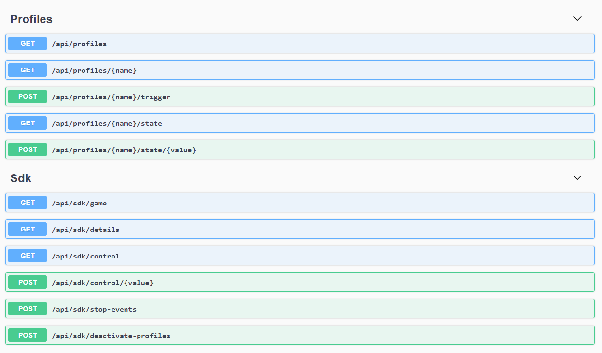

# Open CUE Service  
HTTP REST API service for [Open CUE CLI](https://github.com/Legion2/open-cue-cli).

## Getting Started
Download and extract the latest [release](https://github.com/Legion2/open-cue-service/releases).
Starting with iCUE 3.82.80 the iCUE profiles in the `C:\ProgramData\Corsair\CUE\GameSdkEffects\profiles` directory are used.
Create this directory or configure another one, for details on how to setup profiles see [Open CUE CLI documentation](https://github.com/Legion2/open-cue-cli#profiles).
Then execute the `open-cue-service.exe` to start the service.
It runs on [http://localhost:25555](http://localhost:25555) and can be accessed with any Rest/Http client.
By default the API is only available on localhost for security reasons, if you want to expose it in your network please setup a HTTP proxy with authentication such as nginx.

## API Documentation
The Rest API exposes an OpenAPI Document at `/openapi/v1/openapi.json`.
The API definition can be viewed in the interactive Swagger UI which is hosted at `/openapi`.
Just start the server and open [http://localhost:25555/openapi](http://localhost:25555/openapi).

## Configuration
The profiles directory can be changed, the default is `profiles`.
Change the property `"Game": "<your profile directory>"` in the `appsettings.json`.

The Auto Sync for automatic reconnect and detection of crashed iCUE must be enable in the configuration.
For the Auto Sync feature an additional profile is required, which must be in the selected profile directory.
The profile should be empty and should not have any lighting effect.
The profile is used by the service to check if iCUE is running and can be controlled.
Change the property `"AutoSyncProfileName": "<name of empty profile>"` in the `appsettings.json`.

You can also configure the Auto Sync Interval, which is the time in seconds between the checks if iCUE is running.
Change the property `"AutoSyncInterval": <interval in seconds>` in the `appsettings.json`.

## License
This project is distributed under [Apache License, Version 2.0](LICENSE).

The software iCUE and the file CgSDK.x64_2015.dll are supplied by Corsair Components, Inc. and distributed under different terms.
For more information, contact Corsair Components, Inc.
