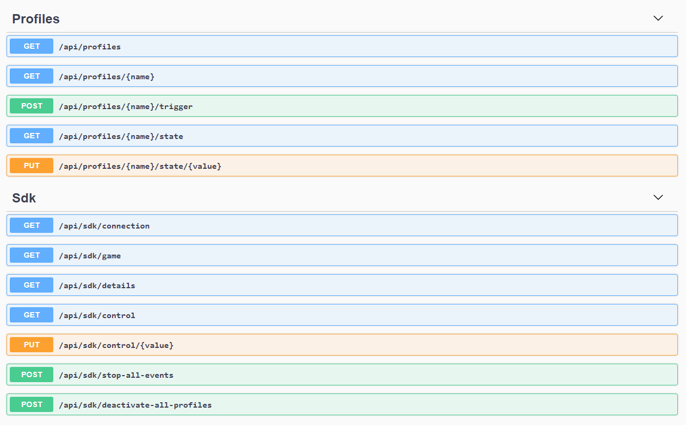

# Open CUE Service  
HTTP REST API service for [Open CUE CLI](https://github.com/Legion2/open-cue-cli).

## Getting Started
Download and extract the latest [release](https://github.com/Legion2/open-cue-service/releases).
Execute the `open-cue-service.exe`.
The server starts on [http://localhost:25555](http://localhost:25555) and can be accessed with any Rest/Http client.

By default the Server controls the iCUE profiles in the `C:\Program Files (x86)\Corsair\CORSAIR iCUE Software\GameSdkEffects\profiles` directory.
See [Open CUE CLI documentation](https://github.com/Legion2/open-cue-cli#profiles) for details on how to setup the profiles.

## API Documentation
The Rest API exposes an OpenAPI Document at `/openapi/v1/openapi.json`.
The API definition can be viewed in the interactive Swagger UI which is hosted at `/openapi`.
Just start the server and open [http://localhost:25555/openapi](http://localhost:25555/openapi).

## Configuration
The profiles directory can be changed, the default is `profiles`.
Add the property `"Game": "<your profile directory>"` to the `appsettings.json`.
